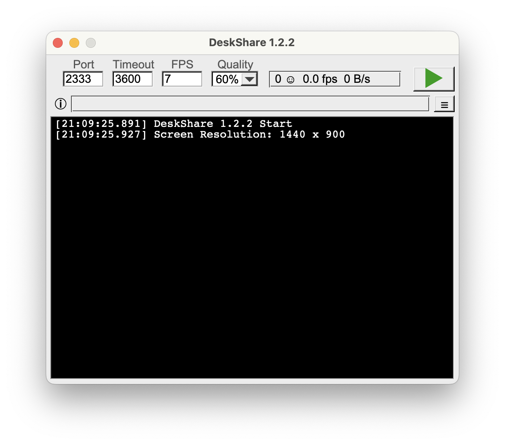

# DeskShare

DeskShare is a desktop sharing tool that can be accessed via a web browser.

[More in GitHub](https://github.com/xspin/deskshare)

## Requirements
- CMake
- libuv
- FLTK
- OpenSSL

## Building

```bash
# build
cmake . -B build && cmake --build build
```

## Preview

